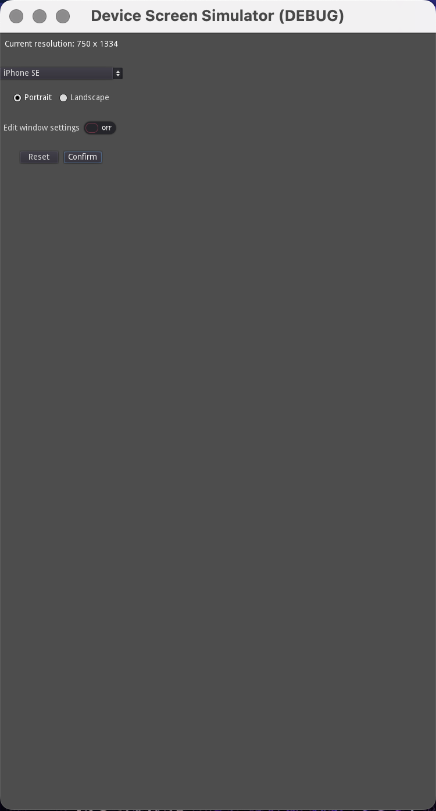
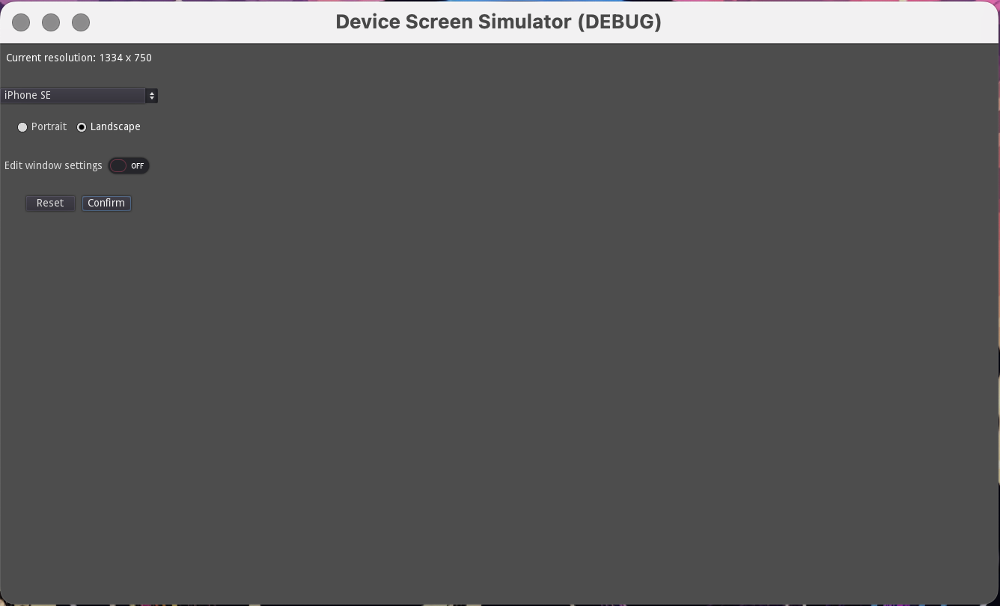
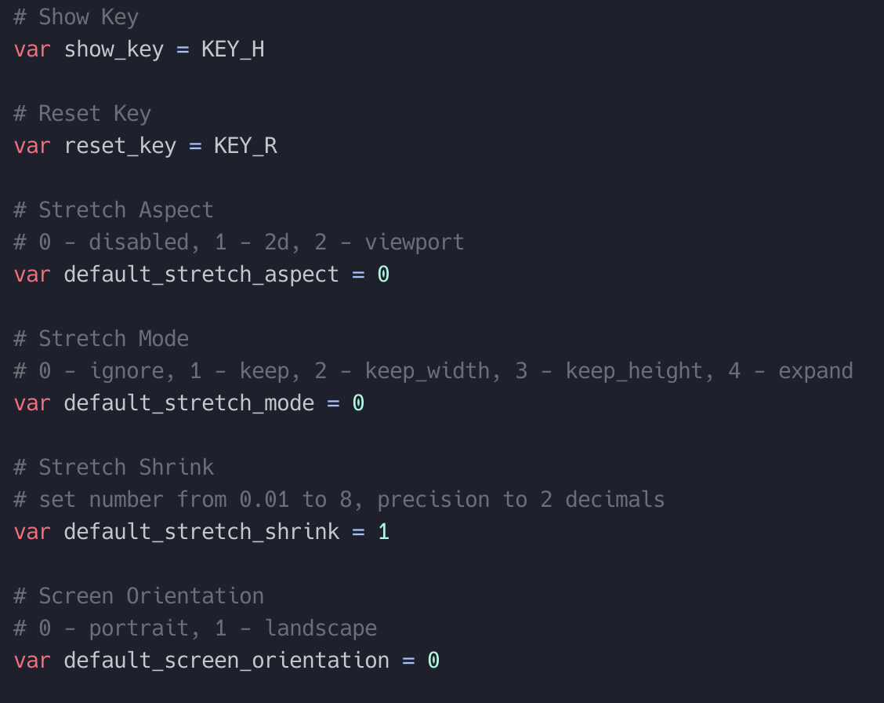
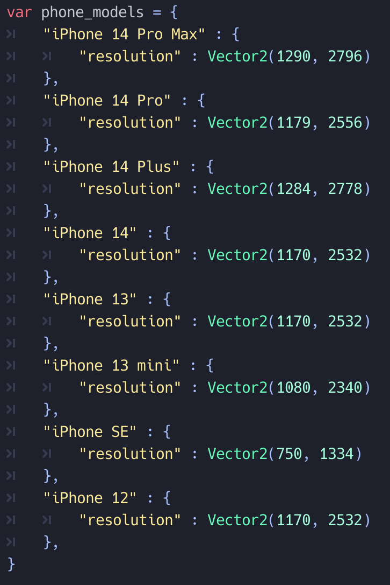

# Device Screen Simulator

Device Screen Simulator is designed to change the resolution of the game during testing.

It allows you to select from different types of mobile devices and adjusts the screen resolution to the resolution of the selected device.

It also allows you to change Stretch Mode, Stretch Aspect and Stretch Shrink.

 

## Settings
I don't know how to get the Stretch Mode, Stretch Aspect and Stretch Shrink settings yet, so I've set some basic values hardcoded.

You can edit them in _res://addons/device_screen_simulator/autoload.gd_

__show_key__ - key to show/hide the settings window

__reset_key__ - key to return the view to default settings

__default_stretch_aspect__ - set the default Stretch Aspect  
default value is _disabled_

__default_stretch_mode__ - setting the default Stretch Mode
default value is _ignore_

__default_stretch_shrink__ - setting the default Stretch Shrink  
default value is _1_

__default_screen_orientation__ - setting the window orientation  
default value is _0_ (portrait)

## List of devices
The devices that can be selected are in the dictionary at _res://addons/device_screen_simulator/autoload.gd_.

Currently, the list contains only current selling iPhones. The list is for testing purposes and I plan to expand it to include more devices.

Extending the list with custom device types is easy - just add custom devices to the dictionary in the format:

_"device name" : { "resolution" : Vector2(width, height)},_

## FAQ

__Why is the "resolution" field in the next dictionary?__  
In the future, I would like the display appearance of the device (various cropping, notch, corner rounding, etc) to be displayed within the plugin. This way there will also be a preview image of the display within the nested dictionary.

__Can I suggest a device I want to add to the list?__  
Yeah, right. Just open [issue](https://github.com/muzzug/Godot_Device_Screen_Simulator/issues/new). I will add new devices as needed.